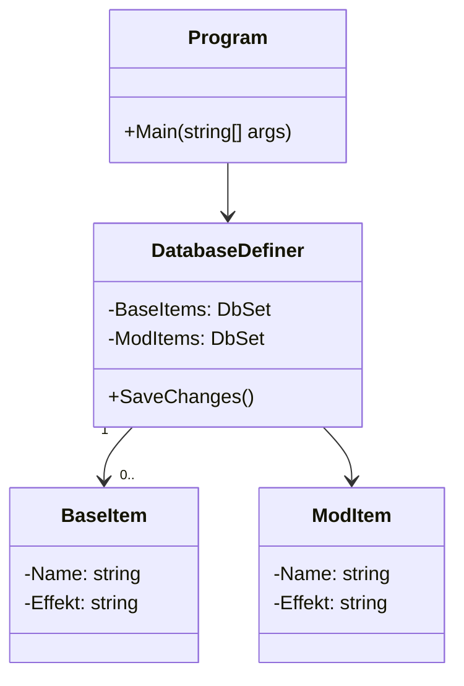

# Projekt-Arbeit-Rahim
### UML:

########

```mermaid
classDiagram
    class Program {
        +Main(string[] args)
    }

    class DatabaseDefiner {
        -BaseItems: DbSet<BaseItem>
        -ModItems: DbSet<ModItem>
        +SaveChanges()
    }

    class BaseItem {
        -Name: string
        -Effekt: string
    }

    class ModItem {
        -Name: string
        -Effekt: string
    }

    Program --> DatabaseDefiner
    DatabaseDefiner "1" --> "0.." BaseItem
    DatabaseDefiner --> ModItem

```
