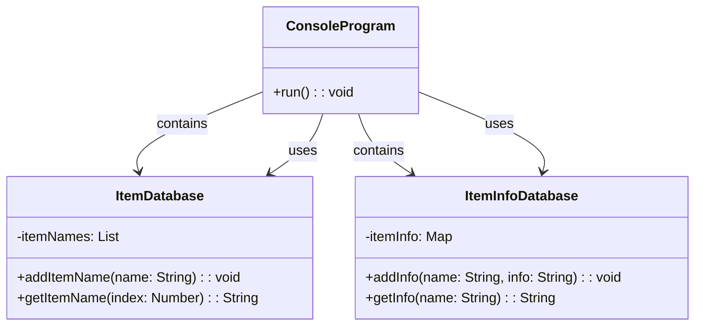
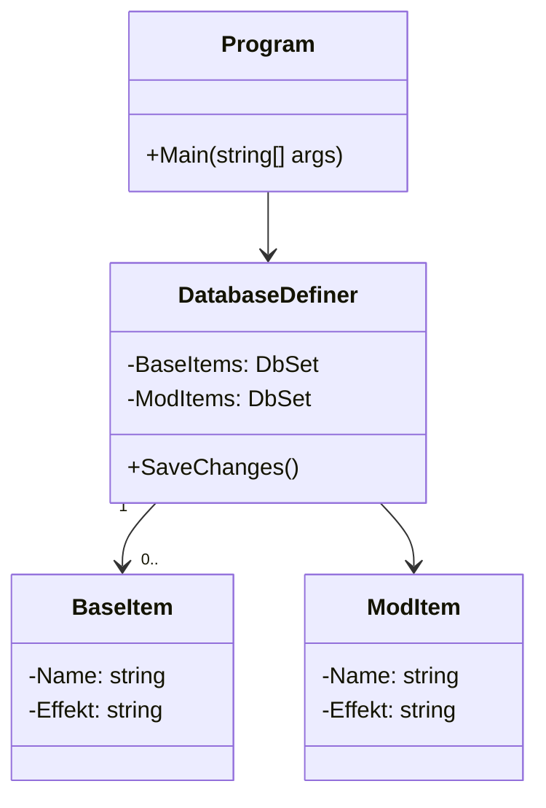

# Projekt-Arbeit-Rahim
### UML:

```mermaid
classDiagram
  class ConsoleProgram {
    +run(): void
  }

  class ItemDatabase {
    -itemNames: List<String>

    +addItemName(name: String): void
    +getItemName(index: Number): String
  }

  class ItemInfoDatabase {
    -itemInfo: Map<String, String>

    +addInfo(name: String, info: String): void
    +getInfo(name: String): String
  }

  ConsoleProgram --> ItemDatabase: contains
  ConsoleProgram --> ItemInfoDatabase: contains

  ConsoleProgram --> ItemDatabase: uses
  ConsoleProgram --> ItemInfoDatabase: uses
```

########

```mermaid
classDiagram
    class Program {
        +Main(string[] args)
    }

    class DatabaseDefiner {
        -BaseItems: DbSet<BaseItem>
        -ModItems: DbSet<ModItem>
        +SaveChanges()
    }

    class BaseItem {
        -Name: string
        -Effekt: string
    }

    class ModItem {
        -Name: string
        -Effekt: string
    }

    Program --> DatabaseDefiner
    DatabaseDefiner "1" --> "0.." BaseItem
    DatabaseDefiner --> ModItem

```
