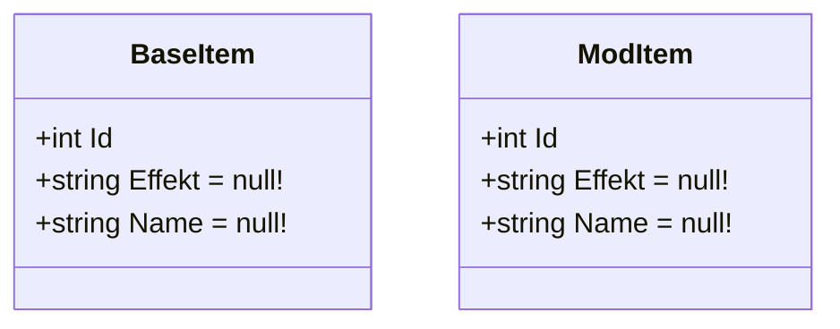

# Projekt-Arbeit-Rahim
### UML:

```mermaid
classDiagram

BaseItem : +int Id
BaseItem : +string Effekt = null!
BaseItem : +string Name = null!

ModItem : +int Id
ModItem : +string Effekt = null!
ModItem : +string Name = null!

```
